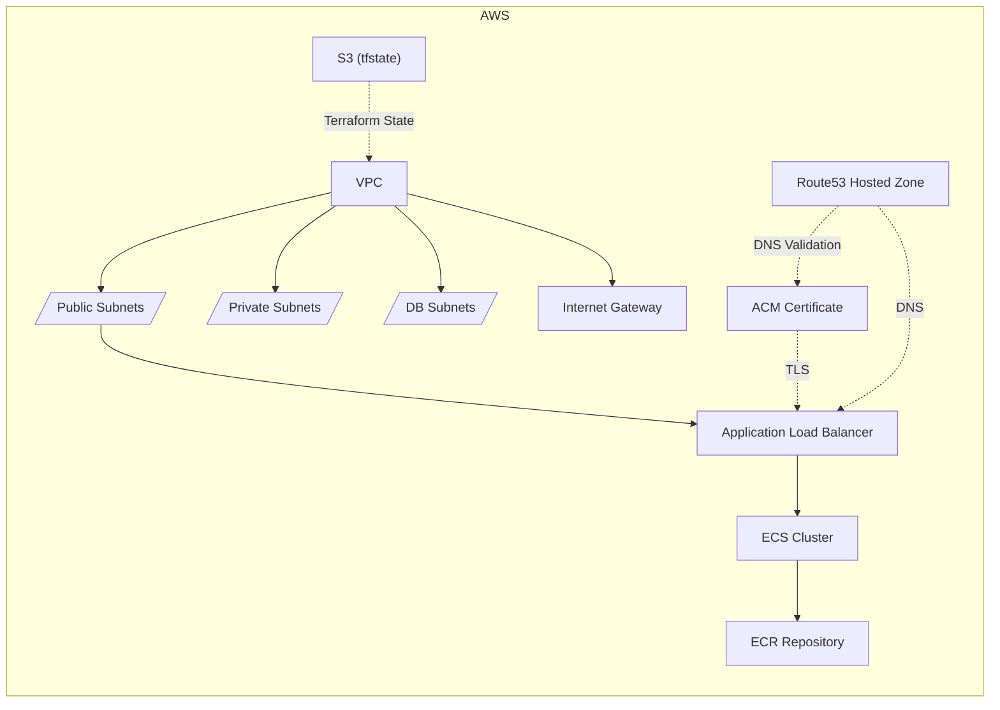

# Telehealth Infra Terraform

This project provisions AWS infrastructure for the Telehealth platform using Terraform.  
Each folder is a module for a specific part of the infrastructure.

---

## Folder Structure & Resources

### `networking/`
- **VPC**: Main Virtual Private Cloud
- **Subnets**: Public, Private, and Database subnets (across multiple AZs)
- **Route Tables**: For public, private, and DB subnets
- **Internet Gateway**: For public subnet internet access
- **Route53 Hosted Zone**: Public DNS zone for `amruta.online`
- **SSM Parameters**: Store VPC and subnet IDs for cross-module use

### `certificates/`
- **ACM Certificate**: Public certificate for `${environment}.amruta.online` (DNS validated)
- **Route53 Record**: For DNS validation of the ACM certificate

### `tfstate/`
- **S3 Bucket**: For storing Terraform state, with versioning and encryption

---

## Architecture Diagram

---

## Usage

1. Configure your AWS credentials.
2. Set variables as needed in each module.
3. Run `terraform init` and `terraform apply` in each folder.

